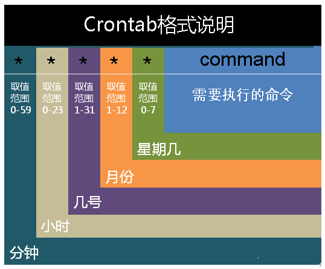

# crontab 是什么

> crontab 命令常见于 Unix 和类 Unix 的操作系统之中，用于设置周期性被执行的指令。该命令从标准输入设备读取指令，并将其存放于 crontab 文件中，以供之后读取和执行。该词来源于希腊语 chronos(χρνο)，原意是*时间*。通常，crontab 储存的指令被守护进程激活， crond 常常在后台运行，每一分钟检查是否有预定的作业需要执行。这类作业一般称为 *cron jobs*。

简单说就是执行计划任务的

# 前期准备

```shell
sudo pacman -S cronie			# 安装
sudo systemctl enable cronie	 # 开机自启
sudo systemctl start cronie		 # 开启服务
```

# crontab配置文件

Linux下的任务调度分为两类：系统任务调度和用户任务调度。Linux系统任务是由 cron (crond) 这个系统服务来控制的，这个系统服务是默认启动的。用户自己设置的计划任务则使用crontab 命令。

在配置文件中可以看到如下解释：

Linux下的任务调度分为两类：系统任务调度和用户任务调度。Linux系统任务是由 cron (crond) 这个系统服务来控制的，这个系统服务是默认启动的。用户自己设置的计划任务则使用crontab 命令。

在配置文件中可以看到如下解释：

```
SHELL=/bin/bash
# 指定了系统要使用哪个shell
PATH=/sbin:/bin:/usr/sbin:/usr/bin
# 变量指定了系统执行命令的路径
MAILTO=root
# 指定了crond的任务执行信息将通过电子邮件发送给root用户
HOME=/
# 指定了在执行命令或者脚本时使用的主目录

# For details see man 4 crontabs
# Example of job definition:
# .---------------- minute (0 - 59)
# | .------------- hour (0 - 23)
# | | .---------- day of month (1 - 31)
# | | | .------- month (1 - 12) OR jan,feb,mar,apr ...
# | | | | .---- day of week (0 - 6) (Sunday=0 or 7) OR sun,mon,tue,wed,thu,fri,sat
# | | | | |
# * * * * * user-name command to be executed
```

## crontab文件含义

用户所建立的crontab文件中，每一行都代表一项任务，每行的每个字段代表一项设置，它的格式共分为六个字段，前五段是时间设定段，第六段是要执行的命令段，`minute hour day month week command`

